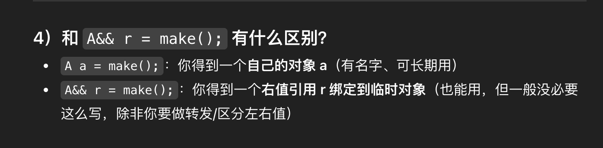
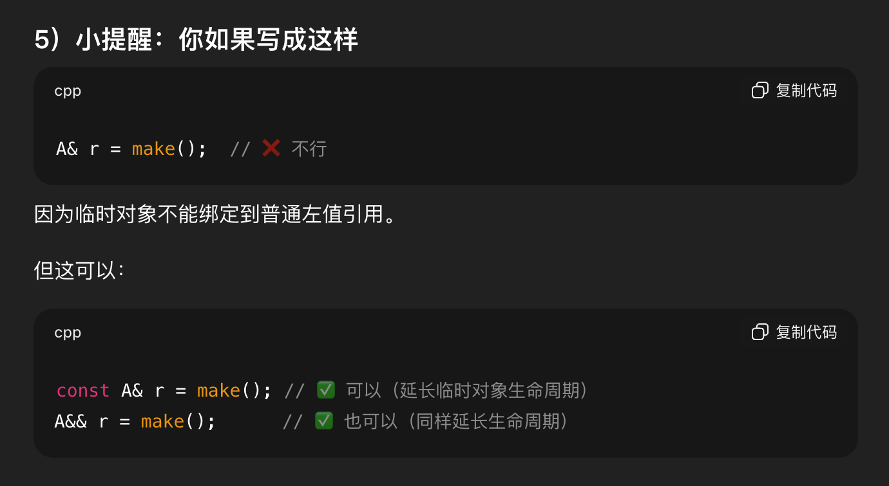

##  全局变量、static变量会初始化为缺省值，而堆和栈上的变量是随机的，不确定的。

## float内存模型
1. 符号位(Sign) : 0代表正，1代表为负

2. 指数位（Exponent）:用于存储科学计数法中的指数数据，并且采用移位存储

3. 尾数部分（Mantissa）：尾数部分

## 右值可以赋值给哪些变量
A make() { return A{0}; } 我可不可以这么写 A a = make()
可以

## new一个数组
int n = 10;
int* a = new int[n];      // 元素是未初始化的（值不确定）
int* b = new int[n]();    // ✅ 全部初始化为 0

struct A {
    A() { /*...*/ }
};

int n = 5;
A* arr = new A[n];   // ✅ 调用 n 次 A()
delete[] arr;        // ✅ 调用 n 次 ~A()

## overload、override、overwrite
overload，将语义相近的几个函数用同一个名字表示，但是参数列表（参数的类型，个数，顺序不同）不同，这就是函数重载，返回值类型可以不同 特征：相同范围（同一个类中）、函数名字相同、参数不同、virtual关键字可有可无
override，派生类覆盖基类的虚函数，实现接口的重用，返回值类型必须相同 特征：不同范围（基类和派生类）、函数名字相同、参数相同、基类中必须有virtual关键字（必须是虚函数）
overwrite，派生类屏蔽了其同名的基类函数，返回值类型可以不同 特征：不同范围（基类和派生类）、函数名字相同、参数不同或者参数相同且无virtual关键字

## extern
正确模式（标准工程写法）
global.h
extern int g;

global.cpp
int g = 10;

other.cpp
#include "global.h"

👉 保证：

只有一个定义

到处都能用

## #pragma once
#pragma once 的意思很简单：

让这个头文件在一次编译过程中只会被 #include 一次（防止重复包含）。

## placement new
void* buf = std::malloc(sizeof(A));   // 1) 手动分配内存

A* p = new (buf) A(42);               // 2) placement new 构造对象

## inline
内联（inline）就是：
把“函数调用”这一步，直接换成“函数代码本身”。

## sizeof 和 strlen
1) sizeof：算“占多少字节”

编译期就能确定（对普通变量/数组/类型）。

返回类型是 size_t

不关心字符串内容里有没有 '\0'，它只看对象/类型的大小。

例子：

char a[] = "abc";
sizeof(a);   // 4  因为数组里是 {'a','b','c','\0'}

再看指针：

char* p = (char*)"abc";
sizeof(p);   // 8 (在 64 位系统上) —— 只是指针大小

2) strlen：算“字符串有几个字符”

运行时从指针开始，一个个找 '\0' 才停

返回的是 不包含 '\0' 的字符数

只适用于“C 风格字符串”（以 '\0' 结尾的 char*）

例子：

char a[] = "abc";
strlen(a);   // 3  （不数 '\0'）

## 数组a和&a
面试题 8：a 和&a 有什么区别
 请写出以下代码的打印结果，主要目的是考察 a 和&a 的区别。

代码语言：javascript
AI代码解释
#include<stdio.h> 
void main( void ) 
{ 
    
 	int a[5]={ 
   1,2,3,4,5}; 
 	int *ptr=(int *)(&a+1); 
 	printf("%d,%d",*(a+1),*(ptr-1));  	
 	return; 
} 
输出结果：2，5。

## 面向对象三大特征
封装性、继承性、多态性

## 赋值
Empty& operator=(const Empty& rhs);
Empty* operator&();
const Empty* operator&() const;

## 完美转发
左值引用描述“可长期使用的对象”，右值引用描述“可被移动的临时对象”，而完美转发的目的，是在模板中不破坏这两者的语义。
一、你真正想要的效果
std::string s = "hello";

log_call(foo, s);        // 左值 → 左值
log_call(foo, "world");  // 右值 → 右值（可 move）

要求：

不改变 foo 的重载选择

不引入额外拷贝

支持任意参数个数、任意类型

二、没有完美转发，会发生什么（常见错误）
❌ 错法 1：按值传参（最蠢但常见）
template<class F, class... Args>
auto log_call(F f, Args... args) {
    log();
    return f(args...);  // ❌ 所有参数被拷贝
}

后果：

大对象被复制

右值丢失 move 机会

性能直接炸

❌ 错法 2：用 const 引用（更隐蔽）
template<class F, class... Args>
auto log_call(F f, const Args&... args) {
    log();
    return f(args...);  // ❌ 右值被当成左值
}

后果：

foo(std::string&&) 永远调不到

移动构造彻底失效

❌ 错法 3：你以为对了，其实还是错
template<class F, class... Args>
auto log_call(F f, Args&&... args) {
    log();
    return f(args...);  // ❌ args 是左值
}

后果：

参数是“转发引用”

但你 没 forward

值类别仍然丢失

名字->左值表达式
否则->右值表达式

auto  = 左值 类型
auto  = 右值 类型

auto& = 类型&
不合法 除非 const auto& 

auto&& = 类型&
auto&& = 类型&&

int&& 只能右值