# C++
## 什么是 .NET Framework 4.7.2

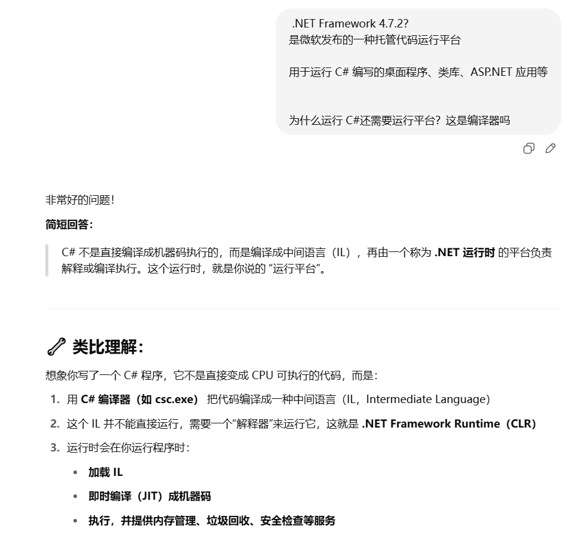
## C#运行在C++项目里，mono扮演了什么角色
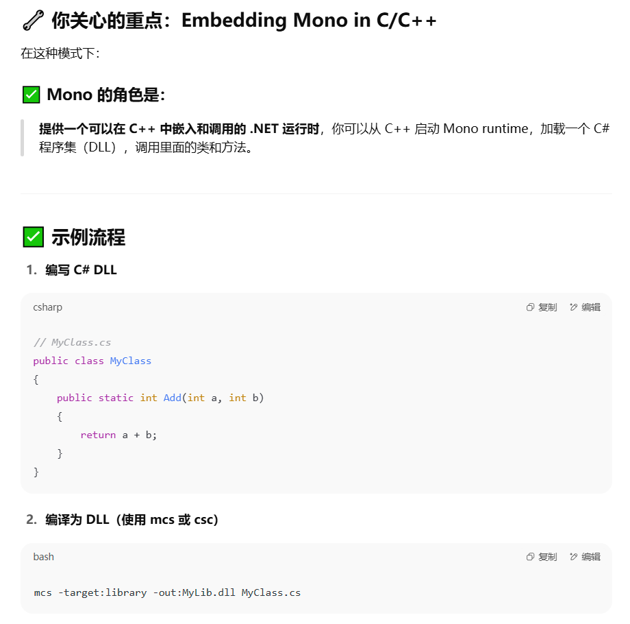
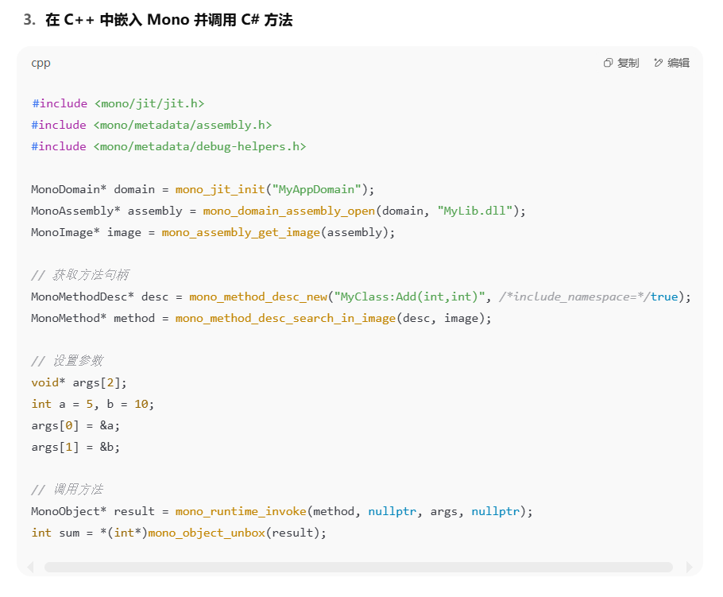
## mono作用，以及与.NET Framework的区别


## 生成解决方案

## 关于visual studio编码
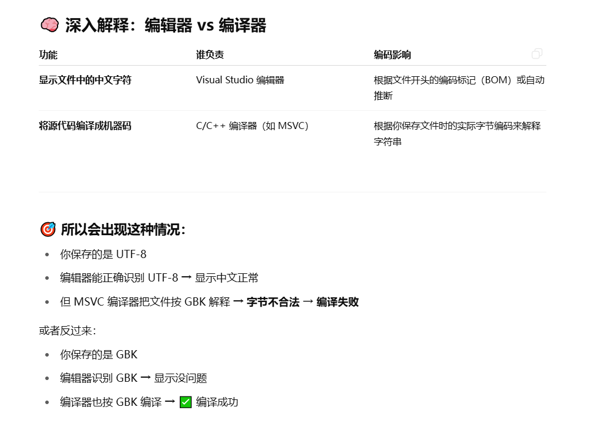
## release和导出disk
这两个不是一个平行的概念，速度只取决于release or debug

# Mono
## mono分为两部分


### 部分1

### 部分2


## 什么是 AppDomain
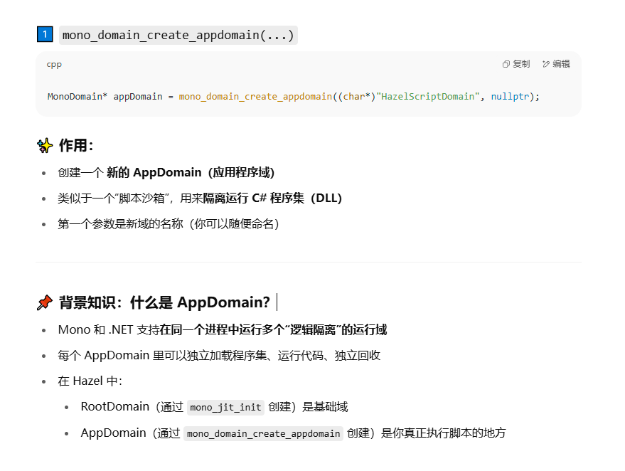
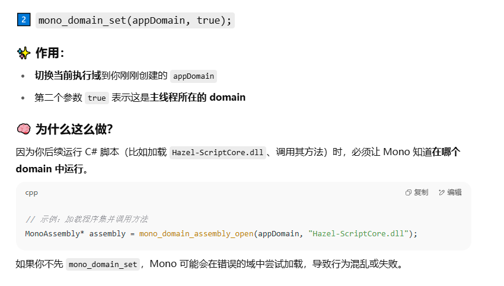
## mono_class_from_name
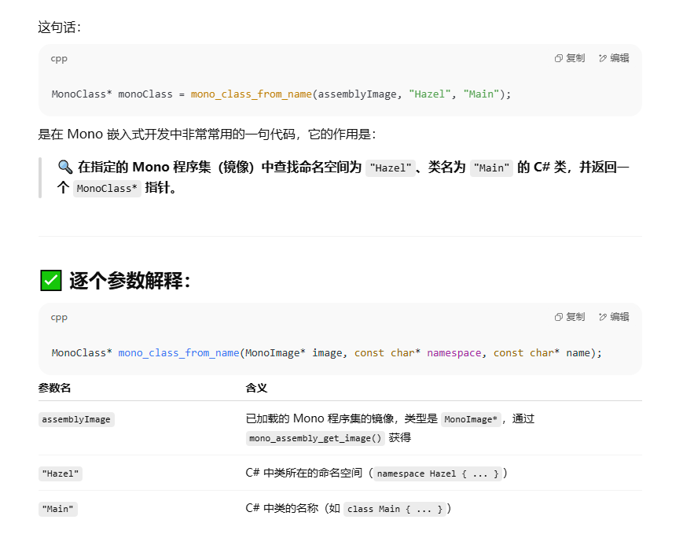
## mono_add_internal_call
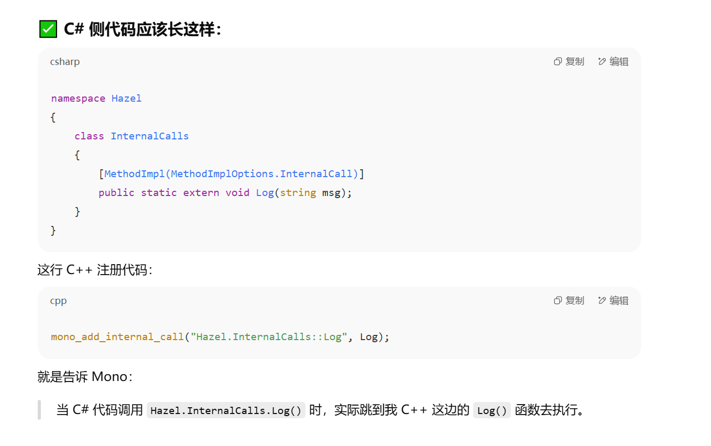
## 加载C#程序集
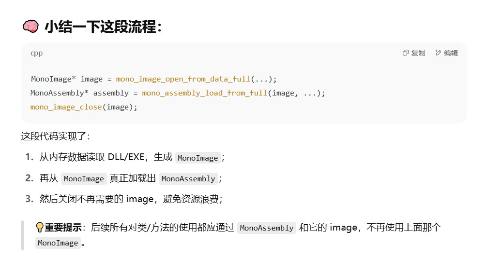

# glm
## glm.dot
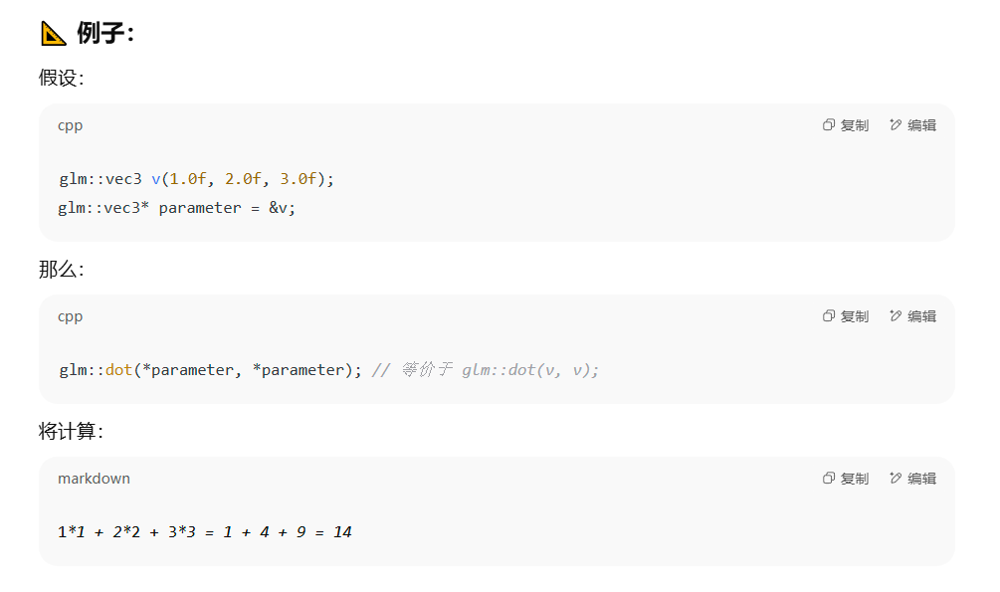

# Imgui
## TreeNodeEX
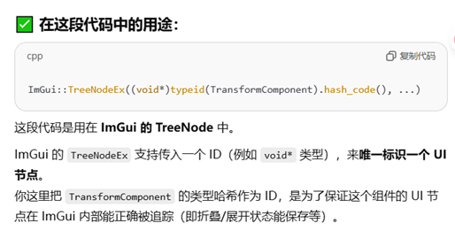

# OpenGL
## glNamedBufferData 与 glBufferData的区别
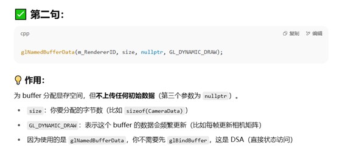
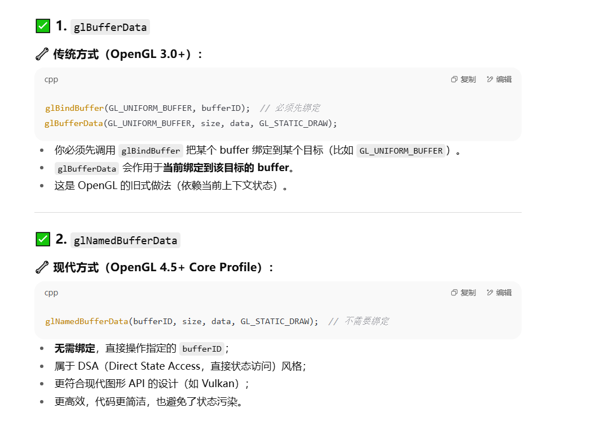
一般的都是 自己创建的对象 绑定到 BUFFER， 然后给BUFFER传数据
## glBindBufferBase
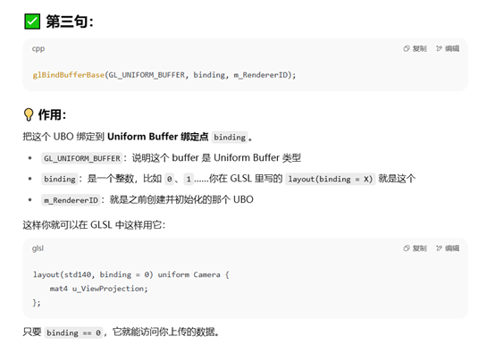
## glBindFrameBuffer
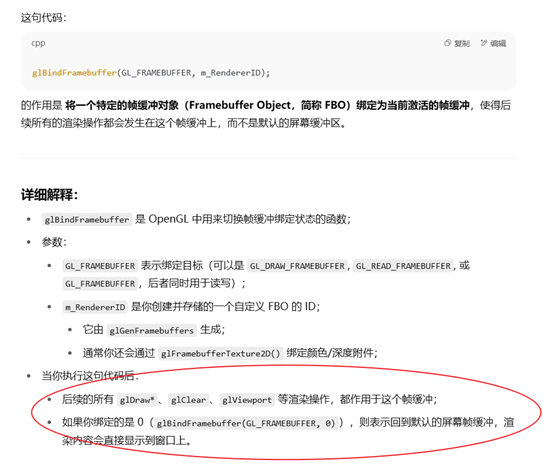
## 绑定纹理glTexImage2D
一般的都是 自己创建的对象 绑定到 TEXTURE2D， 然后给TEXTURE2D，传数据
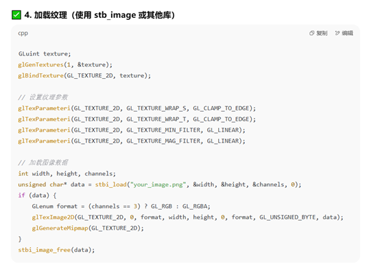
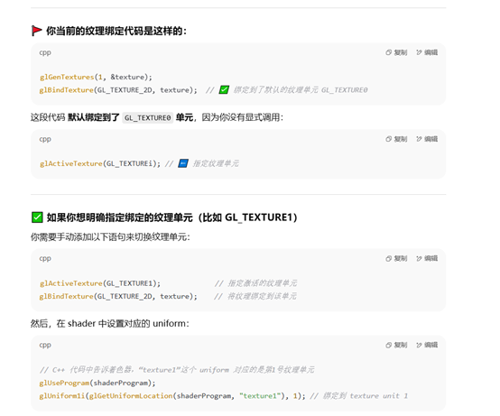
## Vsync
VSync（Vertical Synchronization，垂直同步）信号是指 屏幕刷新周期中的“垂直同步信号”，它的作用是在显示器每次刷新画面开始的时刻，发出一个同步信号，通知显卡可以输出下一帧图像了。
## 顶点着色器->外壳着色器->镶嵌器->域着色器 
顶点着色器在这里的角色发生了变化
当曲面细分被启用时，顶点着色器不再是渲染管线的终点。它的输出也不再是最终的顶点位置，而是作为曲面细分阶段的输入。

所以，此时顶点着色器的工作是：

输入：接收原始模型的顶点数据。

输出：为每个顶点准备好曲面细分所需的 控制点（Control Points）数据。
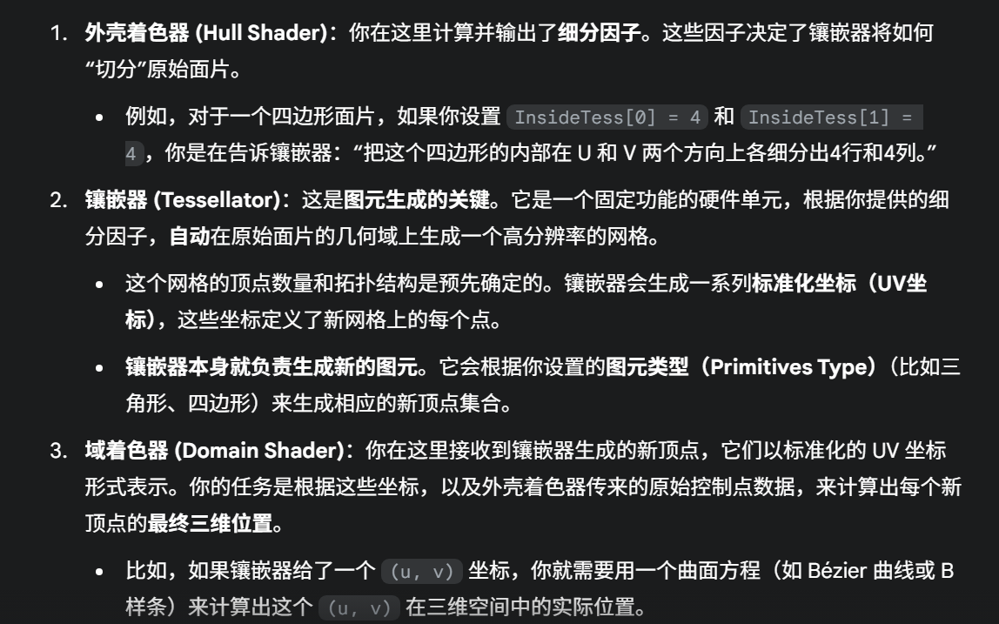
## 渲染管线
顶点着色器->图元装配->几何着色器->光栅化->片段着色器
## G-buffer
**G-Buffer 本质上就是一个帧缓冲对象（FBO）**

**几何阶段 (Geometry Pass)：**
先不进行光照计算，而是渲染场景中的所有物体，并将每个像素的几何属性（如位置、法线、颜色等）存储到 G-Buffer 的不同纹理中。

**光照阶段 (Lighting Pass)：**
使用 G-Buffer 中存储的几何属性，对屏幕上的每个像素进行一次性的光照计算。

**需要澄清的是:** G-Buffer 不是 OpenGL 的一个内置功能或特定对象，而是一种利用 OpenGL 核心功能实现的渲染技术。
G-Buffer 本质上就是你说的帧缓冲对象（FBO）
## shadowmap实现原理

shadow map将深度信息渲染到深度图上，并在运行时通过深度对比检测物体是否在阴影中的算法。

shadow map是一个2-pass的算法

**pass1：** 从Light视角看向场景，记录每个像素的最浅深度，输出一个深度纹理图

**pass2：** 从camera视角出发，检测当前物体深度是否大于深度纹理中深度值，判断是否在阴影里
## mipmap
Mipmap 解决了什么问题？
想象一下，你有一张高分辨率的棋盘格纹理，并把它贴在一个从近处延伸到远处的地面上。

**近处：** 地面上的纹理像素和屏幕上的像素是一一对应的，纹理看起来清晰正常。

**远处：** 地面上的纹理被压缩到一个很小的屏幕区域。一个屏幕像素可能需要代表几十甚至几百个纹理像素。如果 GPU 仍然从原始的高分辨率纹理中采样，就会导致高频信息丢失，产生闪烁、波浪状的锯齿。
## Lod
简单来说，它的核心思想是：离我们近的物体需要高细节，离我们远的物体只需要低细节。

什么是 LOD？
LOD 是 Level of Detail 的缩写，意思是细节层次。它指的是一个物体在渲染时，根据其与摄像机的距离，使用不同复杂度的模型来表示。

近距离：使用高多边形数、高分辨率纹理的高细节模型，以确保视觉效果清晰。

远距离：使用低多边形数、低分辨率纹理的低细节模型，以节省 GPU 性能。

举个例子，在一个游戏中，远处的一座山可能只有一个简单的三角形面片；而当玩家靠近时，它会逐渐变成一个拥有数千个面片、带有复杂纹理的高细节模型。这个过程对玩家来说是无缝的。
## HDR 颜色缓冲
OpenGL 的默认帧缓冲（也就是最终显示在屏幕上的那个）在处理颜色时，其数值范围通常被限制在 0.0 到 1.0。

但是，HDR 颜色缓冲并不是直接用来显示在屏幕上的。它是一个临时的、在内存中存储数据的渲染目标。
例如，创建一个 16 位浮点数的颜色纹理：
```c
// 纹理参数
glTexImage2D(GL_TEXTURE_2D, 0, GL_RGB16F, width, height, 0, GL_RGB, GL_FLOAT, NULL);
```
当你把这张浮点纹理附加到 FBO（帧缓冲对象）上，并进行渲染时，片元着色器就可以自由地输出大于 1.0 的颜色值了

## Bloom
你的描述很准确，Bloom（泛光）效果的实现原理就是如此。

Bloom 效果的作用是模拟真实世界中，强光源（例如太阳、霓虹灯）发出的光线在相机镜头中产生的光晕和溢出效果。它能让场景中明亮的区域看起来更加耀眼和真实，是增强画面沉浸感的重要后期处理技术。

Bloom 的工作原理分解
Bloom 效果的实现分为三个主要步骤，就像你描述的那样：

1. 提取明亮区域
这一步的输出是一张新的图像，这张图像除了那些明亮的区域，其他地方都是黑的。
2. 模糊处理
这一步的输出是一张带有“光晕”效果的图片，它会把明亮区域的光线向周围扩散。
3. 叠加到原场景
叠加时通常会使用加法混合（additive blending）。

## 动态模糊
动态模糊（Motion Blur） 的作用是增强画面的速度感和真实感。

在现实世界中，当我们快速移动物体或相机时，人眼或相机快门会有一个短暂的曝光时间，导致移动的物体在照片上留下模糊的轨迹。这种模糊是一种自然的物理现象。

在游戏中，如果一个物体移动得很快，而画面却保持完全清晰，就会显得非常不真实，甚至让人觉得画面不流畅。

先将图片进行最大程度的模糊处理，再将原图放置在模糊后的图片上面，通过不断改变原图的
透明度（Alpha值）来实现动态模糊效果。
## opengl与openglES

OpenGL ES是OpenGL的嵌入式设备版本，OpenGL ES相对OpenGL删减了一切低效能的操作方式，没有double型数据类型，但加入了高性能的定点小数数据类型。没有glBegin/glEnd/glVertex。
## MVP矩阵w分量的作用
齐次坐标通过引入一个额外的 w 分量，将原本无法用矩阵乘法表示的 **位移（Translation）** 操作，转换成一个统一的 4x4 矩阵乘法，极大地简化了渲染管线的计算。
## 纹理有哪些环绕方式
- GL_REPEAT

    对纹理的默认行为。重复纹理图像。

- GL_MIRRORED_REPEAT

    和GL_REPEAT一样，但每次重复图片是镜像放置的。

- GL_CLAMP_TO_EDGE

    纹理坐标会被约束在0到1之间，超出的部分会重复纹理坐标的边缘，产生一种边缘被拉伸的效果。

- GL_CLAMP_TO_BORDER

    超出的坐标为用户指定的边缘颜色。

## 叉乘
右手定则
## 采样点
小像素，GL_TEXTURE_2D_MULTISAMPLE，多重采样纹理，用于支持抗锯齿
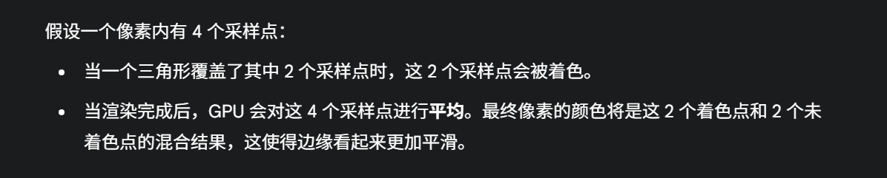
## GL_TEXTURE_MIN_FILTER
比如一个 1024x1024 的纹理被画在一个 100x100 的矩形上
## GL_TEXTURE_MAG_FILTER
当一个纹理覆盖的屏幕像素多于纹理本身的像素时，OpenGL 应该如何采样。
## GL_LINEAR, GL_NEAREST
## GL_TEXTURE_WRAP_R、GL_TEXTURE_WRAP_S 和 GL_TEXTURE_WRAP_T
这三行代码设置了**纹理环绕（Texture Wrapping）** 的方式，这决定了当纹理坐标超出 [0, 1] 的范围时，纹理应该如何显示。纹理坐标通常用 (S, T, R) 来表示，分别对应 X, Y, Z 轴。
## GL_CLAMP_TO_EDGE
将超出纹理范围的坐标值钳制到边缘。这意味着，如果你尝试从 [0, 1] 范围之外的坐标采样纹理，OpenGL 会使用最边缘的纹素颜色
## glCreateTextures
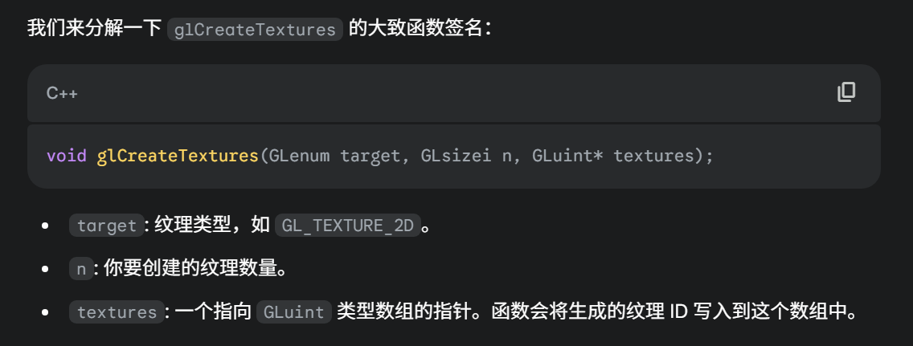
## glBindTexture
GLuint textureID;
glGenTextures(1, &textureID);

// 错误！OpenGL不知道你要设置哪个纹理的参数
// 因为你没有绑定任何纹理到GL_TEXTURE_2D目标
glTexParameteri(GL_TEXTURE_2D, GL_TEXTURE_WRAP_S, GL_REPEAT);
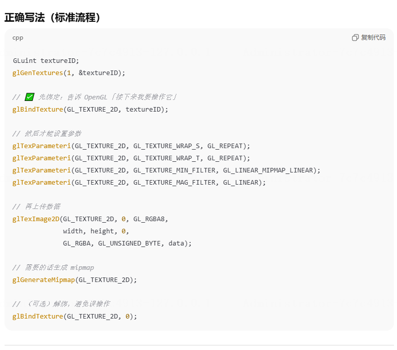
## glCreateTextures
对比于glGenTexture不需要手动绑定也不需要手动解绑
## glCreateVertexArrays
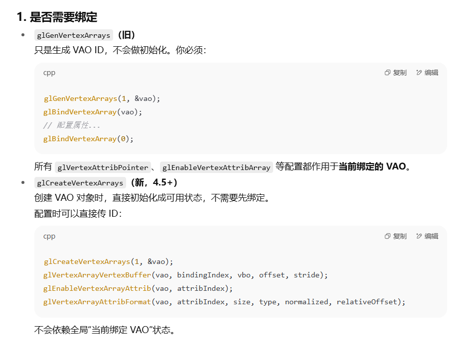
## 使用Create也并非完全不用bind，请看如下解释
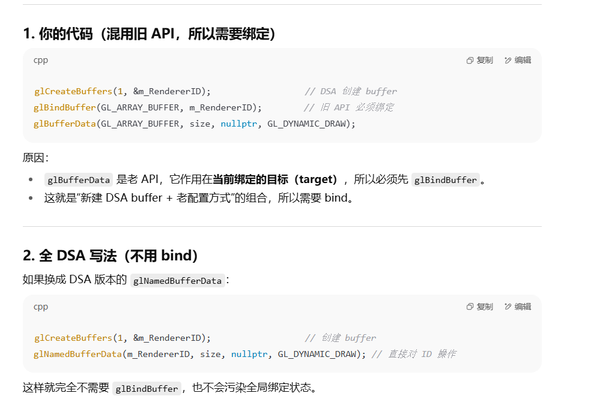
## glPixelStorei(GL_UNPACK_ALIGNMENT, 1);
迷你字节示例（RGB，3 字节/像素）
假设每行 5 像素：

第 0 行：[R0 G0 B0 | R1 G1 B1 | ... | R4 G4 B4] 共 15B

第 1 行紧接着就是：[R5 G5 B5 | ...]（没有填充）

OpenGL（以 16B 行距读取）会把第 0 行后面的“第 16 个字节”当作填充丢掉，
但那其实是第 1 行的 R5。于是第 1 行从 G5 开始被当作 R 通道读取，通道整体右移，整图错位。
## glTextureSubImage2D(m_RendererID, 0, 0, 0, m_Width, m_Height, dataFormat, GL_UNSIGNED_BYTE, data);
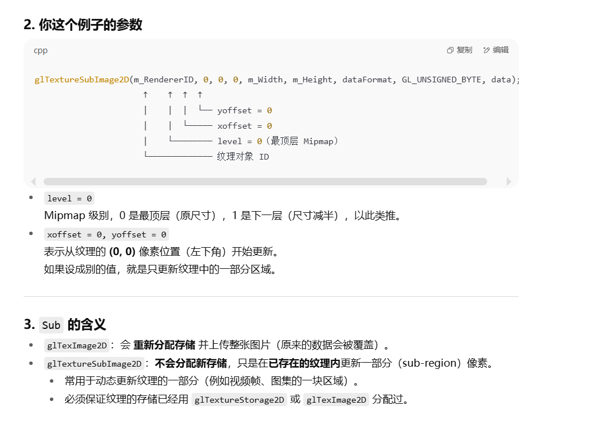
## 数据格式 & 数据类型
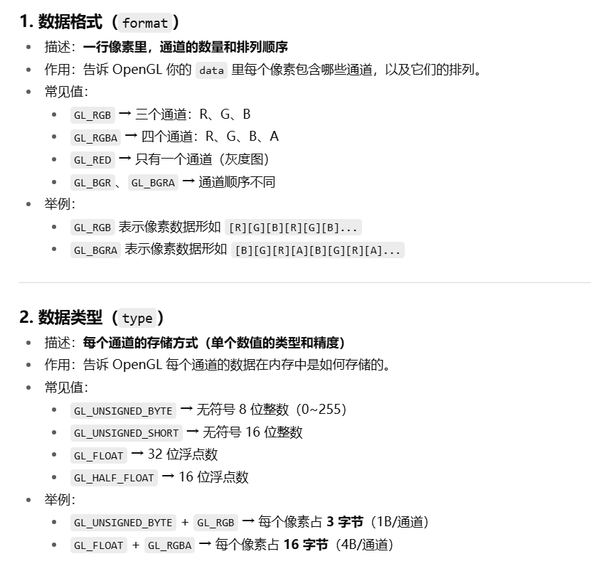
## glBindTextureUnit(slot, m_RendererID);
等于老方法： 
```c++
glActiveTexture(GL_TEXTURE0 + slot);      // 激活纹理单元 slot
glBindTexture(GL_TEXTURE_2D, textureID);  // 绑定到当前激活的纹理
```

单元
## 帧缓冲检查
```c++
glCheckFramebufferStatus(GL_FRAMEBUFFER) == GL_FRAMEBUFFER_COMPLETE
```
一个帧缓冲对象不是创建后就立即可用的。它必须满足以下条件才被认为是**完整（complete）**的：

至少有一个附件：帧缓冲必须附加一个纹理或渲染缓冲对象（renderbuffer object）。

所有附件都有内存：所有附加的纹理或渲染缓冲都已分配了内存。

所有附件都有相同的尺寸：所有附件的宽度和高度必须相同。

至少有一个颜色附件：帧缓冲必须至少有一个颜色附件，或者一个深度/模板附件。

有效的附件类型：颜色附件必须是 GL_COLOR_ATTACHMENTn，深度附件必须是 GL_DEPTH_ATTACHMENT，模板附件必须是 GL_STENCIL_ATTACHMENT
## glDrawBuffers
glDrawBuffers 实际上是在建立一个映射关系：它将片元着色器中的逻辑位置 n 映射到帧缓冲的颜色附件 GL_COLOR_ATTACHMENTn

为什么不能省略 glDrawBuffers？
如果你不调用 glDrawBuffers，OpenGL 会使用它的默认行为。

默认行为：OpenGL 默认只会将渲染结果写入到 GL_COLOR_ATTACHMENT0。

这意味着，即使你的片元着色器中有 layout(location = 1) 和 layout(location = 2) 的输出变量，如果不调用 glDrawBuffers 来明确地激活 GL_COLOR_ATTACHMENT1 和 GL_COLOR_ATTACHMENT2，这些输出数据也不会被写入到帧缓冲中。它们会被直接丢弃。

因此，如果你的目标是同时渲染到多个颜色附件（Multiple Render Targets），你必须调用 glDrawBuffers 来指定所有有效的渲染目标。
## Stencil Test
模板测试包含三个部分：

比较函数：如 GL_EQUAL, GL_ALWAYS, GL_LESS 等。

参考值：一个你自己设定的值。

掩码：用于比较时的位掩码。
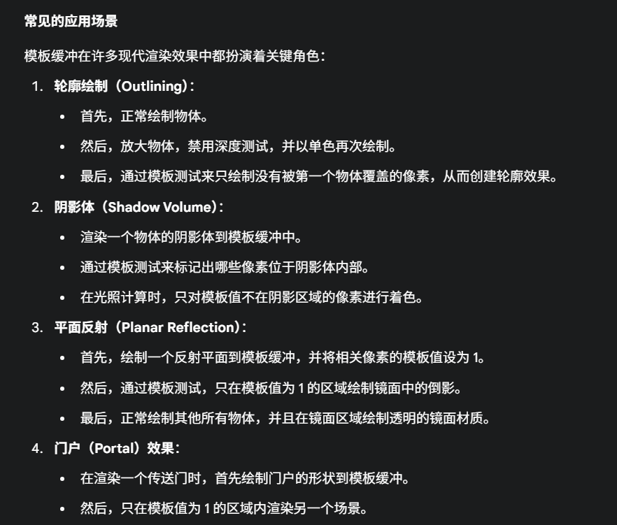
## glDrawArrays(mode, first, count);
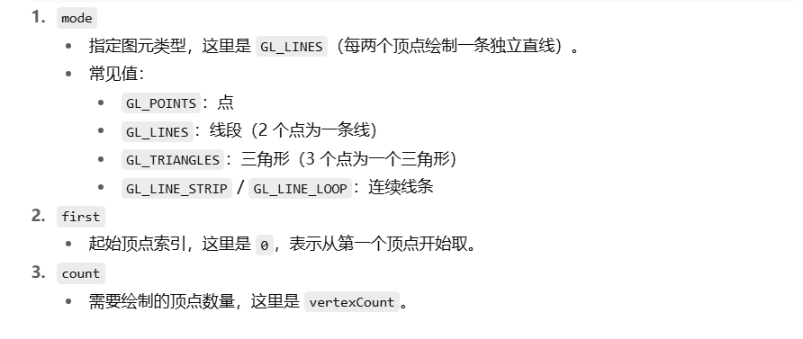
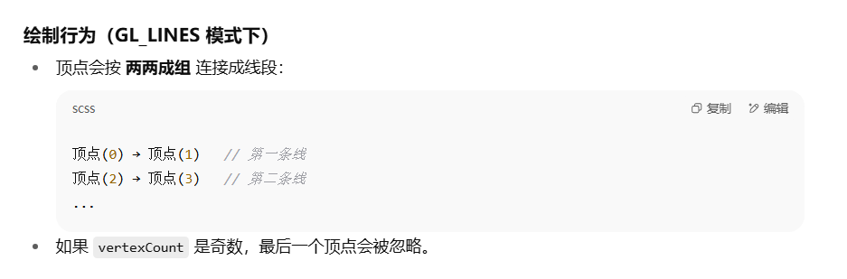
## shader在父类静态函数创建
## Vulkan编译流程
GLSL 源码 (sources)
   │
   ▼
CompileOrGetVulkanBinaries
   │  (GLSL → SPIR-V for Vulkan，缓存)
   ▼
CompileOrGetOpenGLBinaries
   │  (SPIR-V → GLSL(OpenGL) → 编译为 OpenGL 二进制，缓存)
   ▼
CreateProgram
   │  (OpenGL: 链接成 GPU Program)
   ▼
可用的着色器程序
## glShaderBinary
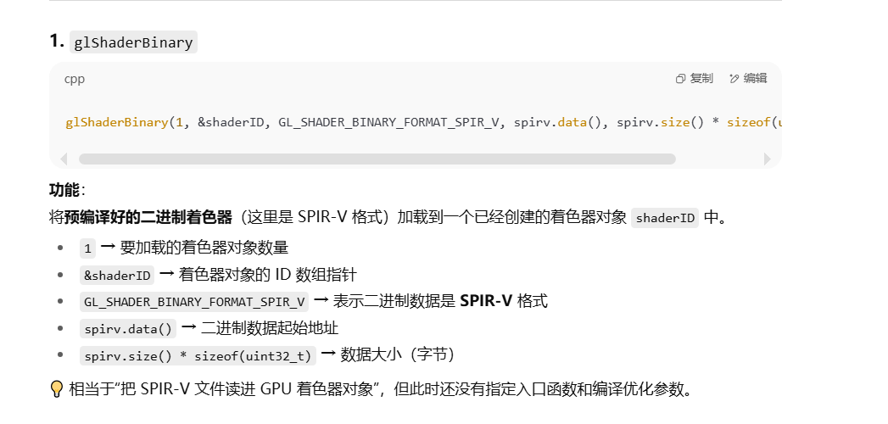
## glShaderSource(vertexShader, 1, &vSource, nullptr);
这个传入的vSource是文本
## glSpecializeShader
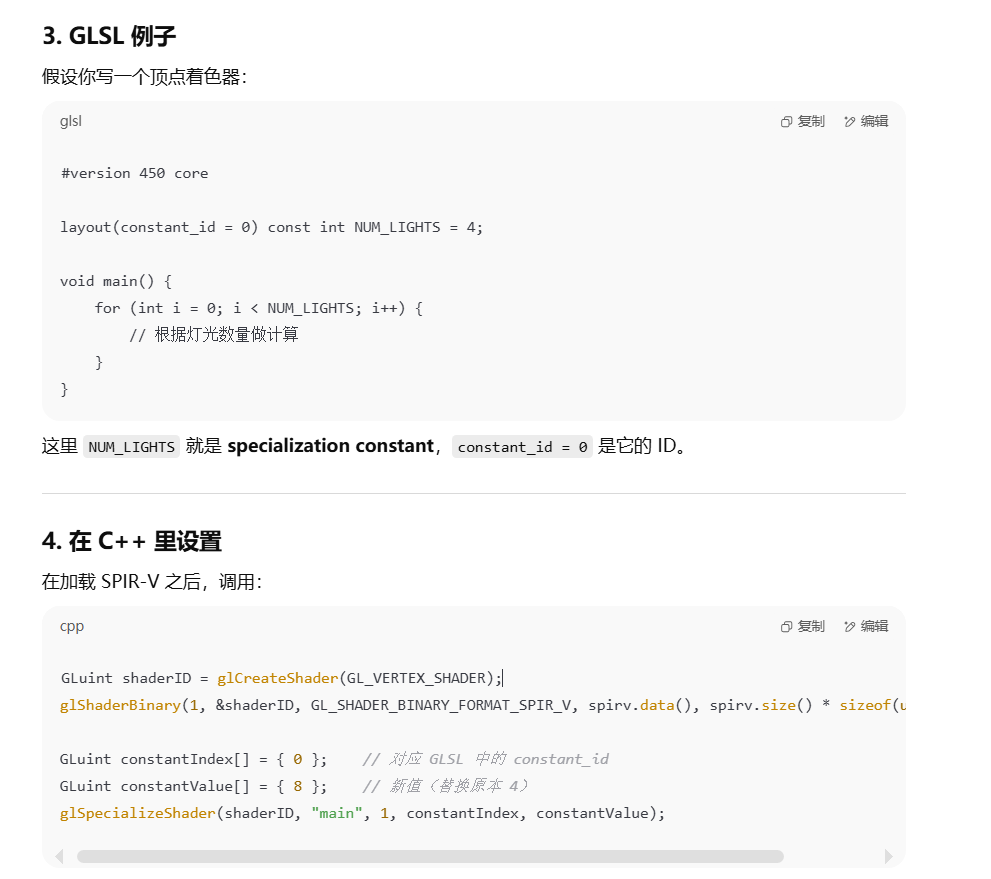


# shader
## out 后面不加flat是自动插值，加了不插值，自动使用第一个顶点的属性值
纹理贴图坐标就要加flat，这样不插值，否则插值了int(1.9999) = 1
## TilingFactor
TilingFactor（平铺因子）是指纹理在一个物体表面上重复（平铺）的次数因子。它控制了纹理坐标的缩放，决定了一张纹理图在几何体上重复多少次。
## 片元最终颜色怎么赋予
**方法1**：
layout(location = 0) out vec4 o_Color;
这句声明了一个 片段着色器的输出变量，类型是 vec4，代表 颜色（RGBA），用于输出到 颜色附件（Color Attachment） 中。
layout(location = 0) 表示它输出到 颜色缓冲0，也就是默认的颜色输出。
变量名 o_Color 是你自定义的，但意义就是“颜色输出”。
**方法2**：
如果只输出一个颜色，直接写没问题，默认绑定颜色缓冲0
out vec4 colorOut;
## 几何着色器
几何着色器的优势不是画折线，而是“在 GPU 上按需生成或变形图元”，实现很多结构性图形扩展/调试/特效功能，虽不万能，但在某些领域仍然独具价值。

## VAO（Vertex Array Object）顶点数组对象
主要作用是用于管理 VBO 或 EBO，减少 glBindBuffer、glEnableVertexAttribArray、glVertexAttribPointer 这些调用操作，高效地实现在顶点数组配置之间切换。
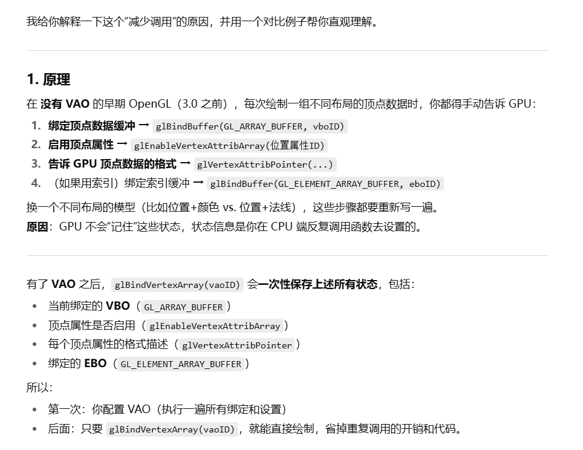
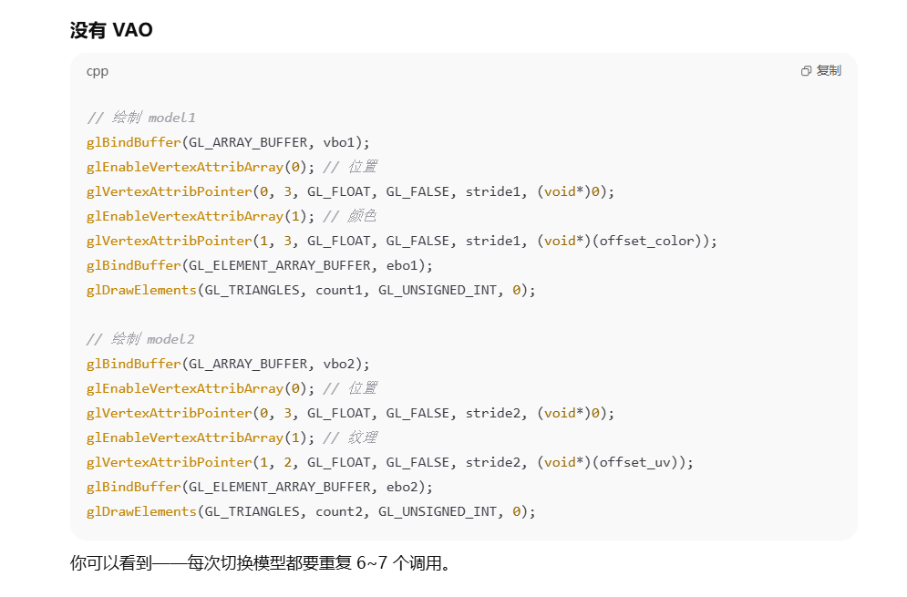
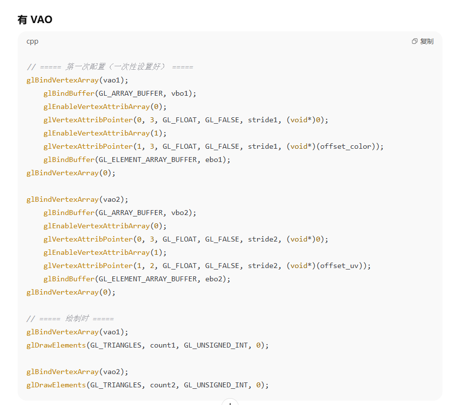
## glVertexAttribPointer(0, 3, GL_FLOAT, GL_FALSE, stride2, (void*)0);
0 表示 binding
3, GL_FLOAT 表示这个属性需要用 3个浮点数表示
stride2, 表示间隔
（void*）0 表示offset（字节数）
## VAO和VBO的绑定关系建立
glVertexAttribPointer(0, 3, GL_FLOAT, GL_FALSE, 3*sizeof(float), (void*)0);时记录
## VAO和EBO绑定是由于哪个语句
glBindBuffer(GL_ELEMENT_ARRAY_BUFFER, ebo) 时记录
## 提前深度测试
提前深度测试(Early depth testing)是一个由图形硬件支持的功能。
提前深度测试允许深度测试在片段着色器之前运行。可以更早地踢掉一些片段永远可见的片元，节省GPU资源 。

## 漫反射
$$I_{\text{diffuse}}=k_d\cdot I_{\text{light}}\cdot\max(0,\mathbf{n}\cdot\mathbf{l})$$

其中：


$\mathbf{n} =$表面法线单位向量

$\mathbf{l} =$指向光源的单位向量 

$k_d=$漫反射系数

点乘结果决定亮度大小
## 镜面光照 Phong与Blinn-Phong
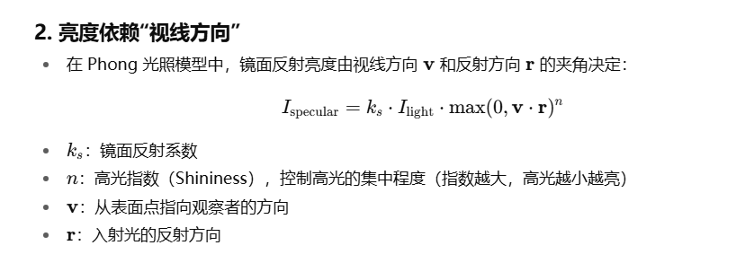
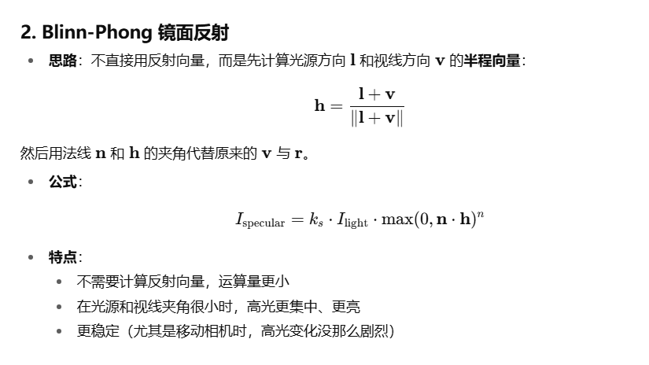
## OpenGL 完全是知道透明度 α 的
因为你输出的 FragColor 本身就是一个 RGBA 向量：
FragColor = vec4(r, g, b, a);
r, g, b → RGB 颜色分量
a → alpha 分量（透明度）
## 混合（Blending）是OpenGL自动做的，在片段着色器之后
## 再画半透明物体（必须从远到近排序！）
必须从远到近排序，是因为 透明物体的颜色混合（Blending）不是交换律，前后顺序会直接影响最终颜色结果。
OpenGL 默认混合公式是：
$$FinalColor = SrcColor \times \alpha_{src} + DstColor \times (1 - \alpha_{src})$$
- SrcColor: 当前要画的片段颜色（源颜色）
- DstColor: 帧缓冲里已经存在的颜色（目标颜色）
## 深度测试
glEnable(GL_DEPTH_TEST);
判断当前片段（像素）是否应该画出来，根据它的深度值和帧缓冲里的深度值比较。
## 深度写入
glDepthMask(GL_FALSE); // 禁止写入
glDepthMask(GL_TRUE);  // 允许写入（默认）
决定是否把新片段的深度值写入深度缓冲。
## 前向渲染
前向渲染是最传统、最直接的渲染流程：
对于场景中每个物体，遍历所有光源，计算它的光照并直接写到帧缓冲。
## 加速
**1.减少 if 分支，改用 step**

分支会导致 GPU 分支发散（不同像素走不同路径会变慢），用 step 或 mix 可以避免。

例子：
```glsl
复制
// 不推荐
if (value > 0.5) 
    color = vec3(1.0);
else 
    color = vec3(0.0);

// 推荐
color = mix(vec3(0.0), vec3(1.0), step(0.5, value));
// step(0.5, value) 会返回 0 或 1，相当于替代 if
```
**2.选择合适的数据精度**

**3.使用内建函数**

```glsl
// 不推荐：手动计算点积
float dotValue = a.x * b.x + a.y * b.y + a.z * b.z;

// 推荐：用内建函数
float dotValue = dot(a, b); // GPU 硬件优化过
```
**4.将计算从像素着色器移动到顶点着色器**

**5. 在脚本中计算并传递给着色器**

比如某个常量值，完全可以在 CPU 端（C++/Unity/C#）算好，通过 uniform 传进来，而不是在 Shader 里每帧重新算
## GPU Flatten
GPU 为什么会有 flatten
GPU 是 SIMD/SIMT 架构（同一时间一个“波”里的多个线程/像素执行同一条指令），所以同一批像素必须执行相同的指令流。
如果你写了 if，而批里的某些像素条件为真、另一些为假，GPU 就出现了分支发散（branch divergence）。

在分支发散时，GPU 不能像 CPU 一样让每个线程独立跑自己的路径，而是会用一种“flatten”方式来保证同步：

把 if 里所有分支的指令都执行一遍

用条件掩码（mask）丢掉不该要的结果

这样就避免了线程跑不同指令流，但代价是你写的分支全都会执行。
## 关于fragment shader
输出由输入决定，也可使用内建变量作为输入， 比如gl_FragCoord是像素坐标
## gl_FragCoord.w干嘛的
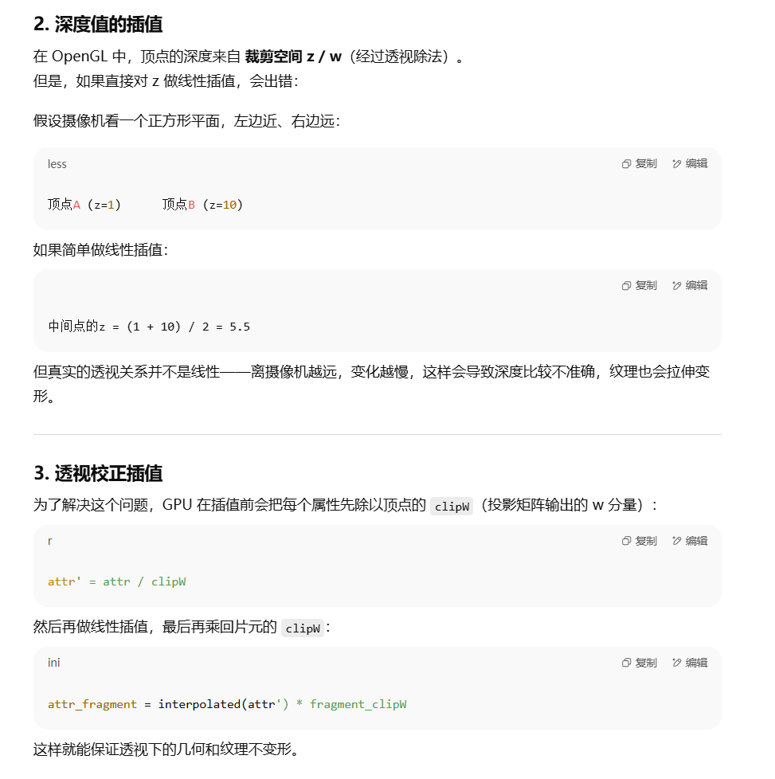


# Unity

## Canvas以及三种渲染模式
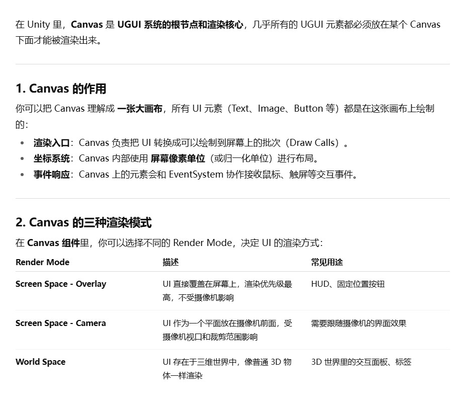
## Text 与 TMPText
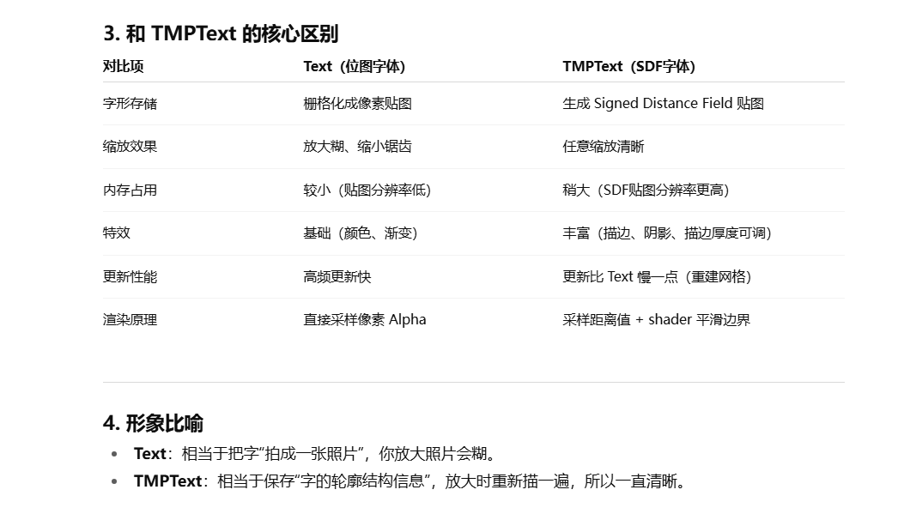
## 红点系统
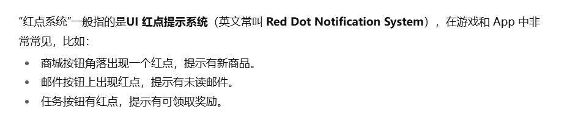
## Animation和Animator
Animation：
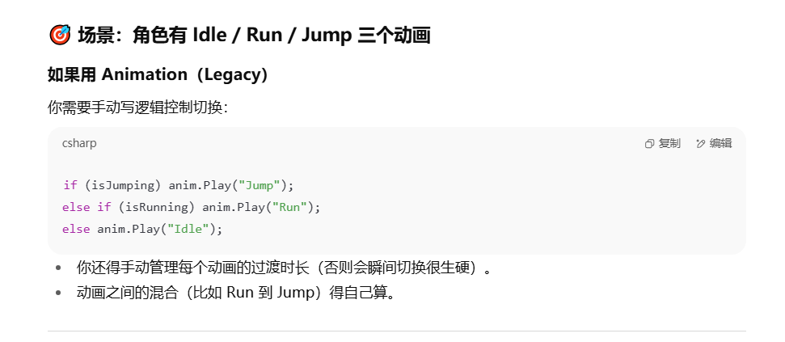
Animator：
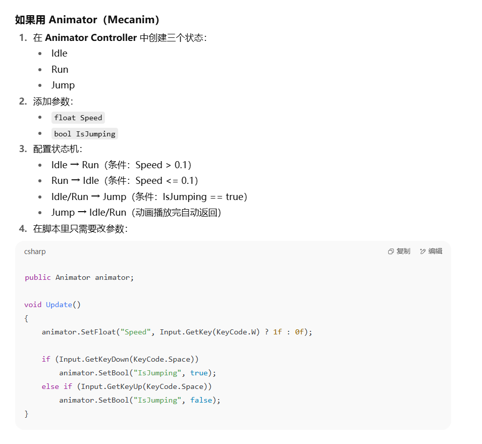
对比优势：
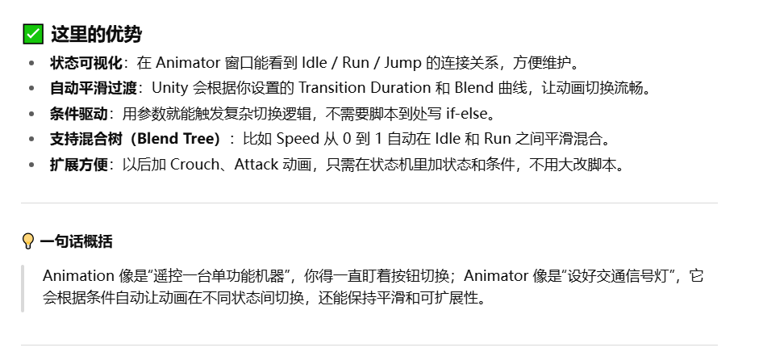
## 骨骼蒙皮网络
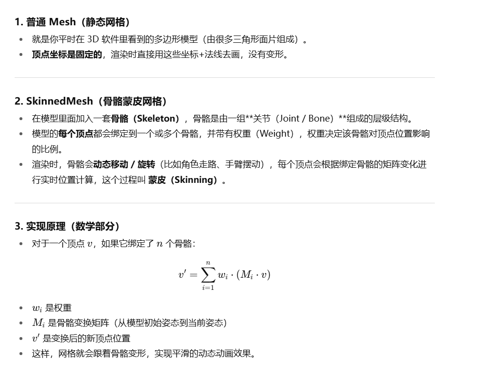
## 渲染器的材质
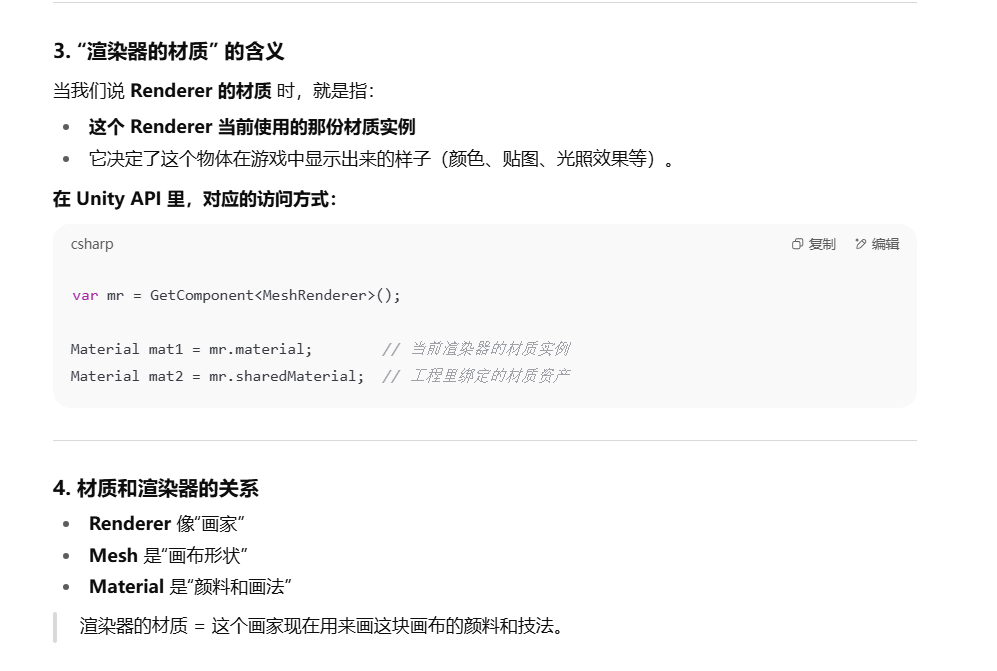

# 语法
## vector.data()
```c++
#include <vector>
#include <iostream>

int main() {
    std::vector<int> numbers = {10, 20, 30, 40, 50};

    // 使用 data() 获取指向内部数组的指针
    int* ptr = numbers.data();

    // 可以像使用普通数组一样访问和修改元素
    std::cout << "First element: " << *ptr << std::endl;      // 输出 10
    std::cout << "Third element: " << ptr[2] << std::endl;    // 输出 30

    // 修改元素
    ptr[0] = 99;
    std::cout << "Modified first element in vector: " << numbers[0] << std::endl; // 输出 99

    return 0;
}
```
## move
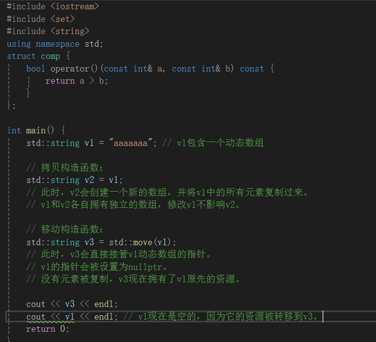
## const
在 C++ 中，函数名后面的 const 关键字用于声明一个常量成员函数，表示该函数不会修改调用它的对象的状态（即不会修改对象的非静态成员变量）。
## 默认拷贝构造函数
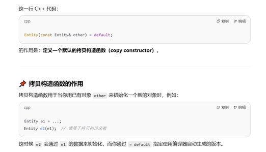
## *filepath 任何时候是指针取引用的意思吗
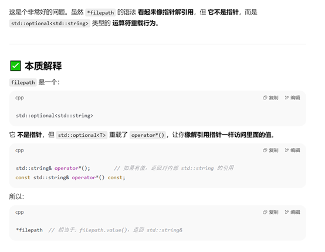
## Bitset.test(x); 
（x index from 0）,用来描述位置x是不是1
## reverse
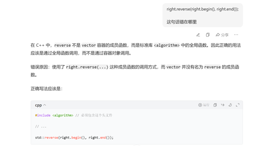
## assign
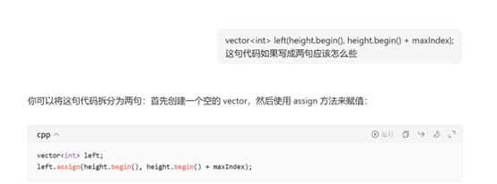
## stoi
## char->string
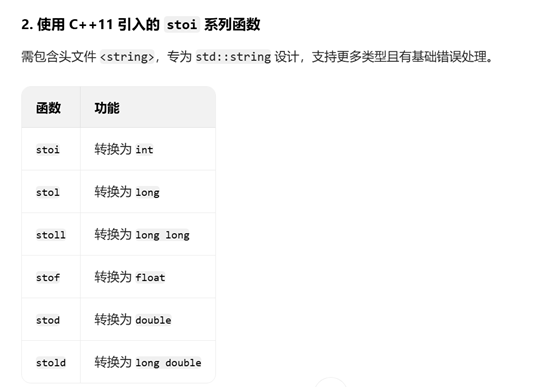3 
1. 用构造函数 string s(c);
2. 或者用s = c
## 自定义排序的唯一推荐方法


## enum 和enum class的区别


## 指针取*是可以当左值的

## weak_ptr


## final
final：用于指示某个类、虚函数或者虚继承在派生时不可被继承或重写。

类：final class MyClass final { ... };，表示该类不能被继承。

虚函数：virtual void myFunc() final;，表示该虚函数在子类中不能被重写。

## static_cast（向下转型）
不做运行时类型检查，错误转换会导致未定义行为。

## dynamic_cast
✔ 用途：
多态类型间的 安全向下转型
需要目标类至少有一个 virtual 函数（即多态）
✔ 特点：
运行时检查类型是否正确
指针失败返回 nullptr，引用失败会抛 std::bad_cast
## reinterpret_cast
完全不同类型之间的转换，例如：
指针 <--> 整数
不同类型的指针之间转换
## 类型强转
int i = 42;
float f = (float)i;  // C 风格转换
// 实际等价于：尝试 dynamic_cast，失败尝试 static_cast，再失败尝试 const_cast，然后 reinterpret_cast
## const_cast
```cpp
void modify(int* p) {
    *p = 42;
}

int main() {
    const int x = 10;
    modify(const_cast<int*>(&x));  // ⚠️ 不安全
    cout << x << endl; // 10
}
```
```cpp
class A {
public:
    void foo() const {
        // this 是 const A*
        A* self = const_cast<A*>(this);
        self->x = 42;  // 修改成员变量（需谨慎）
    }
public:
    int x = 2;
};

int main() {
    A a;
    a.foo();  // 调用 foo 方法
	// 注意：虽然可以修改成员变量，但这可能会导致未定义行为
	cout << "Modified x in A: " << a.x << endl; // 输出修改后的值 42
	return 0;
}
```
## Lambda 表达式
``` c++
#define HZ_BIND_EVENT_FN(fn) [this](auto&&... args) -> decltype(auto) { return this->fn(std::forward<decltype(args)>(args)...); }
```
捕获列表：[] 括号内的内容，用于指定 Lambda 表达式的函数体可以访问哪些 **外部作用域（enclosing scope）** 的变量。

auto&&: 万能引用

std::forward<decltype(args)>：完美转发

decltype(args)：获取参数 args 的原始类型，包括其引用限定符（& 或 &&）

...： 同样是解包参数包，对每个参数都应用 std::forward
## 万能引用
```c++
template<typename T>
void universal_ref_demo(T&& arg) {
    // 这里的 arg 是一个万能引用
    // 当传入左值时，T 会被推导为 T&
    // 当传入右值时，T 会被推导为 T
}
```
T& & 折叠为 T&

T& && 折叠为 T&

T&& & 折叠为 T&

T&& && 折叠为 T&&
T& && 表示参数是（T && t），然后T的类型推导出来是T&
## 完美转发
```c++
#include <iostream>
#include <utility>

// 两个重载版本，用于演示
void some_func(int& x) {
    std::cout << "左值版本被调用, x = " << x << std::endl;
}

void some_func(int&& x) {
    std::cout << "右值版本被调用, x = " << x << std::endl;
}

// 完美转发的包装函数
template<typename T>
void wrapper(T&& arg) {
    std::cout << "在 wrapper 内部... ";
    some_func(std::forward<T>(arg));
}

int main() {
    int x = 10;
    
    // 1. 传入左值
    wrapper(x); // T 被推导为 int&，std::forward<int&>(arg) 返回左值引用
    
    // 2. 传入右值
    wrapper(20); // T 被推导为 int，std::forward<int>(arg) 返回右值引用
    
    return 0;
}
```

## forward
```c++

template <class T>
T&& forward(typename std::remove_reference<T>::type& arg) noexcept;

template <class T>
T&& forward(typename std::remove_reference<T>::type&& arg) noexcept;
```


## explicit （只修饰构造函数）
explicit 关键字用于修饰构造函数，它的主要作用是禁止隐式类型转换。
```c++
struct A {
    int value;
    explicit A(int value) : value(value) {
        std::cout << "construct" << std::endl;
    }
    ~A() {
        std::cout << "deconstruct" << std::endl;
    }
};

void func(A a) {
    // ...
}

int main() {
    A a1 = 10; // 编译错误！不能进行隐式转换
    func(20);  // 编译错误！不能进行隐式转换

    A a2(10); // 正确，这是显式调用构造函数
    A a3 = A(20); // 正确，这也是显式调用构造函数
    func(A(30)); // 正确，显式创建一个 A 对象作为参数
    return 0;
}
```
## Args&& ... args
当编译器看到 Args&& ... args 时，它会知道 args 不是一个单独的参数，而是一个包含多个参数的集合，这些参数的类型由 Args... 决定。

例如，如果你调用 CreateScope("hello", 123)，那么：

Args 包会被推导为 const char*, int。

args 包就是 "hello", 123。
## LayerStack.begin()
```c++
class LayerStack
{
public:
    LayerStack() = default;
    ~LayerStack();

    void PushLayer(Layer* layer);
    void PushOverlay(Layer* overlay);
    void PopLayer(Layer* layer);
    void PopOverlay(Layer* overlay);

    std::vector<Layer*>::iterator begin() { return m_Layers.begin(); }
    std::vector<Layer*>::iterator end() { return m_Layers.end(); }
    std::vector<Layer*>::reverse_iterator rbegin() { return m_Layers.rbegin(); }
    std::vector<Layer*>::reverse_iterator rend() { return m_Layers.rend(); }

    std::vector<Layer*>::const_iterator begin() const { return m_Layers.begin(); }
    std::vector<Layer*>::const_iterator end()	const { return m_Layers.end(); }
    std::vector<Layer*>::const_reverse_iterator rbegin() const { return m_Layers.rbegin(); }
    std::vector<Layer*>::const_reverse_iterator rend() const { return m_Layers.rend(); }
private:
    std::vector<Layer*> m_Layers;
    unsigned int m_LayerInsertIndex = 0;
};
```
## 纯虚函数
纯虚函数 (= 0)
一个虚函数后面加上 = 0，就意味着它是一个纯虚函数。

作用： 纯虚函数只定义了一个接口，而没有提供实现。它告诉编译器和开发者：“所有继承我的子类都必须实现这个函数。”

后果： 只要一个类包含至少一个纯虚函数，那么这个类就成为了一个抽象类（abstract class）。你无法创建抽象类的对象。
```c++
	class GraphicsContext
	{
	public:
		virtual ~GraphicsContext() = default;

		virtual void Init() = 0;
		virtual void SwapBuffers() = 0;

		static Scope<GraphicsContext> Create(void* window);
	};
```

## 普通虚函数
一个虚函数没有 = 0，它就是一个普通的虚函数。

作用： 普通虚函数提供了默认的实现。它告诉编译器：“这个函数可以被子类重写（override），但如果子类不重写，就使用我提供的这个默认实现。”

后果： 包含普通虚函数的类不是抽象类，你可以直接创建它的对象。
## 普通虚函数活着普通的成员函数必须提供实现
## 默认构造函数 = default
```c++
struct IDComponent
{
    UUID ID;
    IDComponent(UUID id) : ID(id) {} // 添加了一个自定义构造函数

    // 编译器就不会再自动生成默认构造函数了
    // 除非你显式地告诉它：
    IDComponent() = default; 
};
```
## 获取一个函数的返回类型
```c++
int f(double, float) {
    return 1;
}
```
```c++
template <class R, class... Args>
R getRetValue(R(*func_ptr)(Args...));
// 其中R(*func_ptr)(Args...)是一个函数指针， 函数指针名为func_ptr, 返回R， 参数Args...
```
```c++
using ret_t = decltype(getRetValue(f));
```
## emplace_back and push_back

## ([&]() { /* ... */ }(), ...);
([&](){ ... }(), ...) 意思是：对 Component... 中的每个类型，生成并执行一次这个 lambda
## 捕获
- [] ： 不捕获任何变量
- [=] ： 把外部变量 复制一份 存到 lambda 里。
- [&] ： 保存的是 外部变量的引用/地址，所以后续外部变量变化，lambda 里看到的也是最新的值。
## int main(int argc, char** argv)

## 类的静态方法实现需要写static吗
对的，实现的时候前面不需要再写 static，而且写了也会编译错误
## include " " 和 <> 的区别
#include <文件名> 是包含标准库头文件的方式，编译器会按照标准路径顺序搜索。

#include "文件名" 是包含用户自定义或者项目内部头文件的方式，优先在当前目录查找，然后才是按照标准路径顺序搜索。
## int (*getAddFunctionPointer())(int, int) { ... }

## virtual 析构


## 移动构造函数、拷贝构造函数


# entt
## 概述
(实体组件系统（ECS）库)
## Entity（实体）
仅是一个 ID，例如玩家、敌人、子弹。
## Component（组件）
描述数据，比如位置、速度、血量等。仅包含数据，不包含逻辑。
## Entity类的AddComponent
```c++
T& AddComponent(Args&&... args)
{
    HZ_CORE_ASSERT(!HasComponent<T>(), "Entity already has component!");
    T& component = m_Scene->m_Registry.emplace<T>(m_EntityHandle, std::forward<Args>(args)...);
    m_Scene->OnComponentAdded<T>(*this, component);
    return component;
}
```
在 m_Scene 的注册表中，为 m_EntityHandle 所代表的实体，使用 Args 包中的所有参数，高效地构造一个类型为 T 的新组件，并返回对这个新组件的引用。
## m_Registry.create()
返回一个从未有过的实体ID
## volatile
不要对它的访问进行优化
保证都要直接从内存读取或写回


## extern c


## extern C，如果C语言也是用C++编译器编译的也需要加extern c吗
不需要
## const修饰类对象或者类指针


## mutable

## struct vs class
在 class 中，默认的成员访问权限是 private，在 struct 中，默认的成员访问权限是 public

当没有显式指定继承方式时，class 默认是 private 继承，而 struct 默认是 public 继承。
## protected
- 外部访问：
在 main 函数这样的非继承或非友元函数中，你依然无法通过点（.）来访问 protected 成员。protected 成员对于外部世界来说，和 private 成员一样是不可见的。


## 三种继承方式对权限的影响

## malloc 和 new， free和 delete 

## 栈、堆、静态存储区、常量区


# glfw
## glfwPollEvents();  
处理所有窗口和输入事件
## glfwWindowHint(GLFW_OPENGL_DEBUG_CONTEXT, GLFW_TRUE); 
让你能够直接从OpenGL驱动程序获得详细的、人类可读的错误信息。
## GLFW、GLAD、OpenGL
是的，在加载 GLAD 之前，必须先加载 GLFW。
这个顺序是强制性的，原因在于 GLAD 的工作方式。让我们再次回顾一下它们各自的职责：

- GLFW：负责创建和管理 OpenGL 上下文。
- GLAD：需要一个已存在的 OpenGL 上下文才能获取函数地址。
## glfwSwapBuffers(m_WindowHandle);

去掉就全白


# 不懂
## 动态Lod
## 阴影算法


# HAZEL
## 程序的启动
建一个子类继承自 **Application类** , 实现createApplication函数。
## 程序的运行
往Application中插入许多layer
每个时间戳timestep:
```c++
layer->OnUpdate(timestep);
layer->OnImGuiRender();
```
## 事件回调（以resize窗口事件为例）
1. glfw创建的窗口本身就可以resize，不需要其他额外操作
2. windowswindow中使用glfwSetWindowSizeCallback，将回调函数XXX作为参数
3. 其中XXX中调用了我们的回调函数Application::OnEvent，且是使用了window
4. OnEvent的参数是自己创建的类Event 
## 为什么EventCallbackFn需要放在结构体windowdata里面


## Application成员	
```c++
private:
	static Application* s_Instance;
```
在第一次实例化Application的时候就确定了，并ASSERT其为空。确保只有一个实例
## CopyComponent方法
1.先获取有某个Component的Entity
2.对于这个Entity取出ID
3.通过这个ID取出dstEntity
4.dst.emplace_or_replace
目前只用于完全复制整个场景
## Component类
- IDComponent UUID
- TagComponent name
## CopyComponentIfExists(AllComponents{}, newEntity, entity);
将entity的组件全部copy到newEntity里去
## 渲染系统实现了哪些功能
1.	场景渲染管理
•	支持场景的初始化、关闭、窗口大小调整（自动设置视口）。
•	支持多种摄像机类型（正交摄像机、通用摄像机、编辑器摄像机）进行场景渲染。
2.	2D渲染功能
•	支持绘制各种2D图元，包括：
•	普通矩形（Quad）
•	旋转矩形（Rotated Quad）
•	圆形（Circle）
•	线段（Line）
•	矩形边框（Rect）
•	精灵（Sprite，支持贴图和颜色混合）
•	支持批量渲染（Batching），自动管理顶点缓冲区和索引缓冲区，提升性能。
•	支持多纹理绑定和采样，自动分配纹理槽。
•	支持自定义颜色、纹理、平铺因子（TilingFactor）、实体ID（用于编辑器选中等功能）。
3.	渲染命令抽象
•	封装了底层渲染API（如OpenGL），提供统一的渲染命令接口，包括：
•	设置视口
•	设置清屏颜色
•	清屏
•	绘制索引图元
•	绘制线段
•	设置线宽
4.	FrameBuffer支持
•	支持自定义帧缓冲格式（颜色、深度、模板等），可用于后处理、选中检测等高级功能。
5.	统计与性能分析
•	统计DrawCall数量、渲染的Quad数量等，便于性能分析和优化。
## RenderScene
以EditorCamera为视角
## EditorLayer::OnAttach
1. 创建Icon
2. 创建FrameBuffer
3. 创建EditorCamera
## EditorLayer::OnUpdate
1. resize FrameBuffer
2. m_EditorCamera.OnUpdate
3. m_ActiveScene->OnUpdate
4. get m_HoveredEntity
5. EditorLayer::OnOverlayRender（）只渲染边框
## EditorLayer::OnImGuiRender
## window有属性context
创建window之后立刻调用
m_Context->Init();

# STD
## std::ios::in
以“读”模式打开文件（input mode）
## in.seekg(0, std::ios::end);


# 2DBox
## b2_kinematicBody

## m_PhysicsWorld->Step(ts, velocityIterations, positionIterations);


# 技术
## 高斯模糊


# 算法
```c++
// 递归版欧几里得算法
int gcd(int a, int b) {
    return b == 0 ? a : gcd(b, a % b);
}
```

```c++
int find(int x) {
    return x == parent[x] ? x : parent[x] = find(parent[x]);
}
```

```c++
#include <bits/stdc++.h>
using namespace std;

// Fenwick Tree / BIT：1-indexed
struct Fenwick {
    int n;
    vector<long long> bit; // 存计数，用 long long 更稳妥
    Fenwick(int n = 0) { init(n); }
    void init(int n_) { n = n_; bit.assign(n + 1, 0); }
    // 在 idx 位置加 val
    void add(int idx, long long val) {
        for (; idx <= n; idx += idx & -idx) bit[idx] += val;
    }
    // 查询前缀和 [1..idx]
    long long sum(int idx) const {
        long long r = 0;
        for (; idx > 0; idx -= idx & -idx) r += bit[idx];
        return r;
    }
    // 查询区间和 [l..r]
    long long rangeSum(int l, int r) const {
        if (l > r) return 0;
        return sum(r) - sum(l - 1);
    }
};

int main() {
    ios::sync_with_stdio(false);
    cin.tie(nullptr);

    int n;
    if (!(cin >> n)) return 0;
    vector<long long> a(n);
    for (int i = 0; i < n; ++i) cin >> a[i];

    // 坐标压缩
    vector<long long> vals = a;
    sort(vals.begin(), vals.end());
    vals.erase(unique(vals.begin(), vals.end()), vals.end());
    auto getRank = [&](long long x) {
        return int(lower_bound(vals.begin(), vals.end(), x) - vals.begin()) + 1; // 1-based
    };

    Fenwick ft((int)vals.size());
    long long ans = 0;
    for (int j = 0; j < n; ++j) {
        int rk = getRank(a[j]);
        long long seen = ft.sum((int)vals.size()); // 已出现总数
        long long le   = ft.sum(rk);               // ≤ a[j] 的个数
        ans += (seen - le);                        // > a[j] 的个数
        ft.add(rk, 1);                             // 记录 a[j] 已出现
    }

    cout << ans << '\n';
    return 0;
}
```
