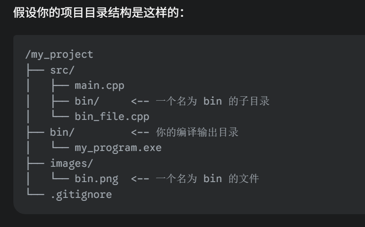
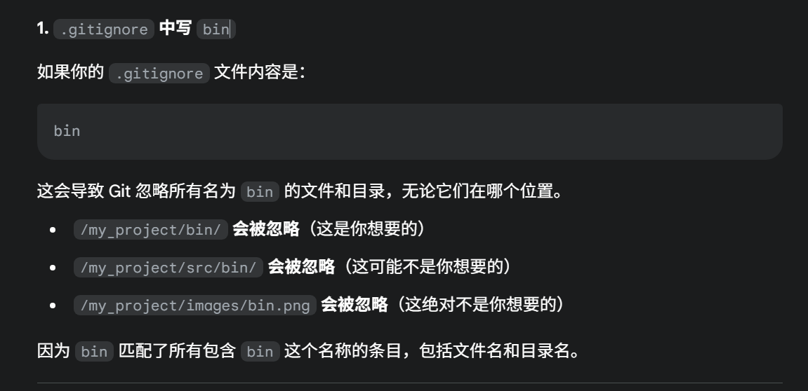
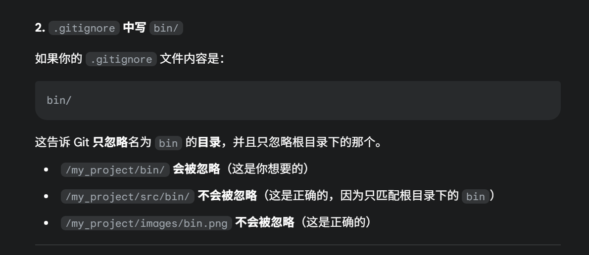
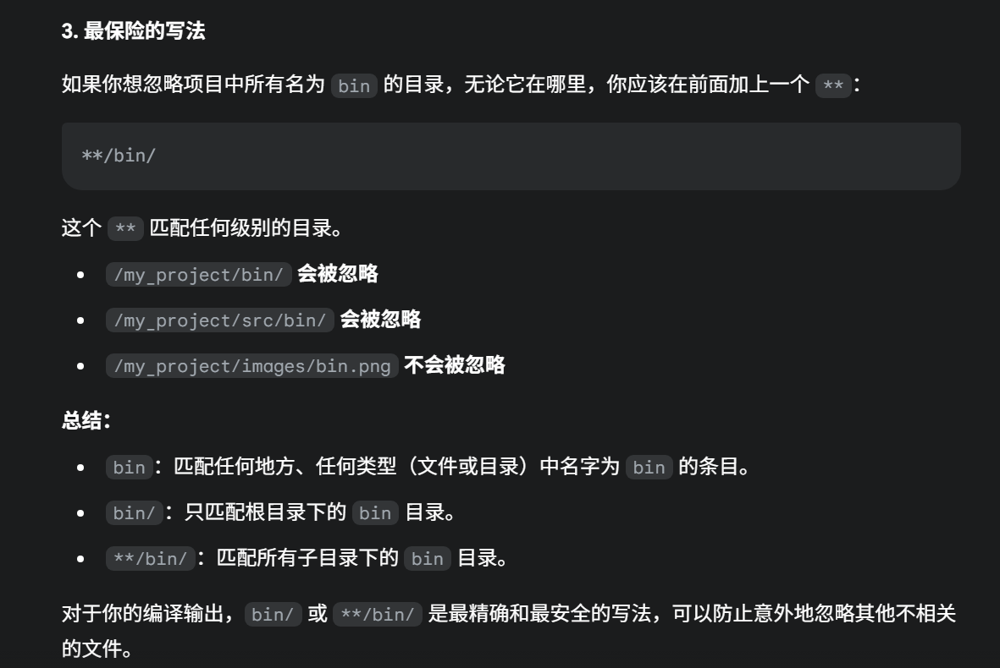

# git
## git remote -v 
要查看当前本地 Git 仓库是从哪个远程仓库克隆下来的，可以使用 git remote 命令
## 如何查看某个文件在哪几次提交中被修改了
git log <文件路径>
## git ls-files
列出 Git 正在跟踪的所有文件
## bin， bin/， **/bin, **/bin/ in gitignore

## git diff glm/gtx/component_wise.hpp